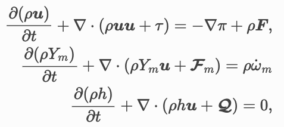
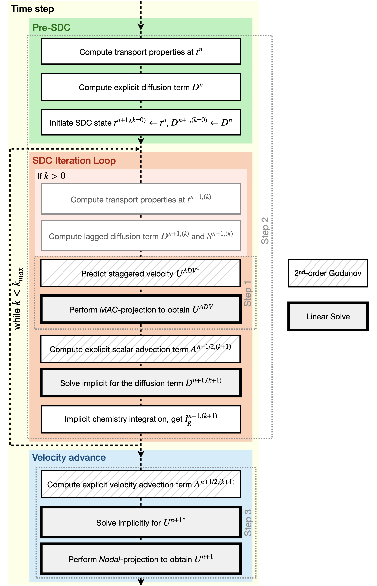

# PeleLMeX model
> [PeleLM about models](https://amrex-combustion.github.io/PeleLM/manual/html/Model.html#sdc-preliminaries)  
> [PeleLMeX about models](https://amrex-combustion.github.io/PeleLMeX/manual/html/Model.html#mathematical-background)
# 概要
PeleLMeXは、化学反応する低マッハ数の流れをブロック構造の適応的メッシュ（AMR）を適用させている．
このコードは、AMReXライブラリに依存しており、基礎となるデータ構造と、超並列コンピューティングアーキテクチャでそれらを管理・操作するツールを提供している．
PeleLMeXは、AMReX-Hydroのソースコードとアルゴリズム基盤も利用している．
PeleLMeXは、PeleLMから発展している．PeleLMの中核となるアルゴリズムは,以下の論文で説明される．
- A conservative, thermodynamically consistent numerical approach for low Mach number combustion. I. Single-level integration, A. Nonaka, J. B. Bell, and M. S. Day, Combust. Theor. Model., 22 (1) 156-184 (2018)

- A Deferred Correction Coupling Strategy for Low Mach Number Flow with Complex Chemistry, A. Nonaka, J. B. Bell, M. S. Day, C. Gilet, A. S. Almgren, and M. L. Minion, Combust. Theory and Model, 16 (6) 1053-1088 (2012)

- Numerical Simulation of Laminar Reacting Flows with Complex Chemistry, M. S. Day and J. B. Bell, Combust. Theory Model 4 (4) 535-556 (2000)

- An Adaptive Projection Method for Unsteady, Low-Mach Number Combustion, R. B. Pember, L. H. Howell, J. B. Bell, P. Colella, W. Y. Crutchfield, W. A. Fiveland, and J. P. Jessee, Comb. Sci. Tech., 140 123-168 (1998)

- A Conservative Adaptive Projection Method for the Variable Density Incompressible Navier-Stokes Equations, A. S. Almgren, J. B. Bell, P. Colella, L. H. Howell, and M. L. Welcome, J. Comp. Phys., 142 1-46 (1998)

> [複雑化学のための低マッハ近似](https://crd.lbl.gov/assets/pubs_presos/MCS/CCSE/LMCSDC.pdf)

# 特徴
- 輸送係数などの物性値は[EGLIB](http://www.cmap.polytechnique.fr/www.eglib/)というライブラリを使用している．
- 状態方程式は現在，$PV=nRT$を採用している．また，Soave-Redlich-Kwongの式が今後実装される予定である．
- 温度勾配による拡散Soret効果を考慮している．
- 基礎方程式  
  やはり摂動による圧力$\pi$と熱力学的圧力$P_0$は別の変数を扱っているみたい
    
  濃度勾配による物質拡散$F_m$，コーシー応力$\tau_{i,j}$ ，熱流速$Q$はそれぞれ
    
  しかし，これらの基礎方程式は低マッハ条件下では過剰すぎるため，いくつかの効果は無視される．

    
  with  
    

  低マッハ近似を行うのは，音響波の伝播の影響は系全体のダイナミクスにとって重要でないため，運動方程式から音響波伝播を数学的に除去する．
  
- 物性値計算
  - 粘性(viscocity)$\mu$  
    うーむ，何かの計算で求めてるみたい．
    共役勾配法の1ステップに基づき, 温度依存の衝突積分比を利用して推定される（EGZE3）. 
    
  - 熱伝達率
    こっちは経験則みたい.

- 計算アルゴリズム
  

  step1:
  セル中心のデータから，セル界面の$U^{ADV, \ast}$
